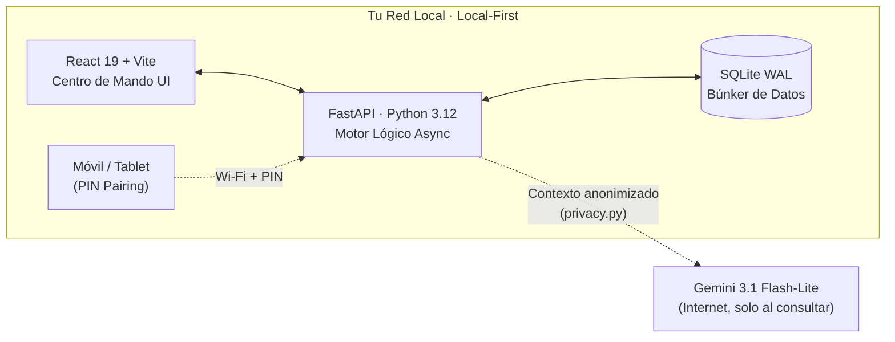

<div align="center">

# 🏛️ Tabula Rasa
### Sistema Operativo Financiero Soberano & AI-Agentic Ecosystem

*Privacidad blindada, integridad matemática absoluta (Zero-Floating-Point) y orquestación autónoma impulsada exclusivamente por **Gemini 3.1 Flash-Lite**.*


</div>

> **"Finanzas limpias. Privacidad absoluta. Inteligencia implacable."**

Bienvenido al repositorio de **Tabula Rasa**. Este no es un simple rastreador de gastos; es un ecosistema financiero de **Grado Industrial** diseñado bajo el paradigma de **Local-First AI**. Tabula Rasa funciona como tu cerebro financiero privado, residiendo íntegramente en tu hardware. Elimina la dependencia de nubes corporativas y garantiza la privacidad absoluta de tu patrimonio, al tiempo que integra modelos fundacionales de Inteligencia Artificial como auditores, consejeros y procesadores de datos multimodales.

Este documento es un "Deep Dive" (análisis de Rayos X) exhaustivo de la arquitectura, las capacidades, el motor de inteligencia y la topografía de módulos del sistema. Ningún detalle técnico ha sido omitido — y donde algo todavía no está construido, este documento lo dice explícitamente en vez de maquillarlo.

## 📑 Índice

1. [Arquitectura de Sistemas y Visión de Ingeniería](#arquitectura)
2. [El Ecosistema de Inteligencia Agentizada](#inteligencia-agentizada)
3. [Topografía de Módulos](#topografia-modulos)
4. [Orquestación y DevOps](#devops)
5. [Guía de Inicio Rápido](#inicio-rapido)
6. [Estructura de Directorios Clave](#estructura-directorios)
7. [Novedades y Optimizaciones Recientes](#novedades)

---

<a id="arquitectura"></a>
## 🏗️ 1. Arquitectura de Sistemas y Visión de Ingeniería

El núcleo de Tabula Rasa fue concebido para operar bajo un estrés constante de cálculo financiero, garantizando que jamás se pierda ni se corrompa un solo centavo de tu historial.

### 🗺️ Vista de Alto Nivel



Todo lo que importa —balances, historial, deudas— vive en `DB`. La única llamada que sale de tu red es la consulta puntual a Gemini, y solo con el contexto ya desinfectado.

### 🧬 El Stack Tecnológico y Persistencia
*   **Backend (El Motor Lógico)**: Construido en **FastAPI (Python 3.12)**. Elegido por su insuperable capacidad de procesamiento asíncrono y la validación de datos estricta mediante **Pydantic**.
*   **Frontend (Centro de Mando UI)**: Desarrollado en **React 19** impulsado por **Vite** y estandarizado con **Tailwind CSS**. La interfaz aplica principios de diseño **Glassmorphism**, creando un entorno inmersivo, responsivo y visualmente premium, con micro-animaciones fluidas a 60FPS potenciadas por **Framer Motion**.
*   **Persistencia (El Búnker de Datos)**: Emplea **SQLite en modo WAL (Write-Ahead Logging)**. A diferencia de un SQLite tradicional que bloquea la base en cada escritura, el modo WAL permite lecturas y escrituras concurrentes, combinando la ligereza de un motor local de un solo archivo con la robustez requerida para transacciones asíncronas y scripts en background.
*   **Orquestación de IA**: Integración directa (vía SDK nativo) con **Gemini 3.1 Flash-Lite**, habilitando análisis multimodal (Vision), ejecución estructurada de herramientas (Function Calling), procesamiento de voz y generación de contenido altamente tipado y determinista.

### 📐 Principios de Integridad y Robustez (Core Rules)
1.  **Aritmética de Centavos (Cero Coma Flotante)**: Es la regla de oro del motor matemático. Todos los cálculos internos, balances, deducciones y registros monetarios en la base de datos se almacenan y operan en **enteros (centavos)**. Esto erradica matemáticamente los errores de redondeo binario que destruyen las aplicaciones financieras amateurs. Solo se convierten a dólares (`/ 100`) en la capa final de presentación de la UI.
2.  **Idempotencia Criptográfica**: El motor de importación (`transaction_importer.py` y `statement_intelligence.py`) jamás inserta datos a ciegas. Genera un *hash SHA-256* único por transacción (combinando fecha, monto, emisor y tokens de descripción). Si el usuario sube el mismo extracto bancario CSV o PDF diez veces, el sistema ignorará los duplicados con precisión quirúrgica, previniendo el envenenamiento de los datos de flujo de caja.
3.  **Soft Deletes (Borrado Lógico Inmutable)**: Los registros nunca se eliminan físicamente de la base de datos (`is_deleted = True`). Esto permite la reconstrucción total de historiales de auditoría en caso de errores del usuario y evita rupturas silenciosas en las restricciones de las claves foráneas (Foreign Keys).
4.  **Soberanía de Datos (Local-First)**: Tus balances, historiales, deudas y configuración jamás salen de tu red local. La base de datos reside únicamente en tu disco duro. Cuando el sistema "piensa" usando la IA, se aplica un protocolo de desinfección en `privacy.py`, enviando únicamente el contexto necesario (anonimizado) para que el LLM opere como un "motor semántico ciego".
5.  **Local-Network Sync & PIN Pairing**: El sistema permite la vinculación de dispositivos secundarios (móviles/tablets) dentro de la misma red local. La seguridad se gestiona mediante un **PIN de vinculación dinámico**, eliminando la necesidad de exponer puertos a internet o depender de nubes externas para la sincronización.

---

<a id="inteligencia-agentizada"></a>
## 🧠 2. El Ecosistema de Inteligencia Agentizada

La IA en Tabula Rasa no es un "chatbot" superficial; es un **ecosistema de agentes autónomos y reactivos** con "ojos" (multimodalidad), "manos" (Function Calling) y una memoria estructurada de tus hábitos financieros. 

### 👁️ Capacidades Multimodales y Background Autónomo
1.  **Statement Intelligence (AI Vision)**: `statement_intelligence.py` ingiere extractos bancarios en PDF o imágenes vía Gemini Vision. Extrae fechas de corte, pagos mínimos y desgloses de diferidos. La misma capa multimodal (`ai_receipts.py`) también lee recibos de compra y transcribe comandos de voz.
2.  **Sentinel Agent & Health Monitoring**: El orquestador `sentinel_service.py` vigila la base de datos 24/7. Genera un "Health Score" proactivo basado en liquidez, deudas inminentes y trayectoria de ahorro.
3.  **AI Insights & Anomaly Detector**: `ai_insights.py` y `anomaly_detector.py` realizan auditorías constantes buscando pagos duplicados, desviaciones en el "burn rate" y sugerencias de optimización fiscal.
4.  **AI Audio Interface**: Integración en `ai_audio.py` para procesamiento de comandos de voz, permitiendo una interacción manos libres con el asistente financiero.
5.  **Snapshot Reconciliation Engine**: `snapshot_reconciler.py` detecta cuándo una fotografía mensual de patrimonio neto quedó desactualizada (por ejemplo, al editar una transacción de un mes ya cerrado) y la recalcula bajo demanda, para que tu historial nunca muestre cifras obsoletas.
6.  **AI Goal Optimization**: `ai_goals.py` calcula tu "Safe-to-Spend" real y, solo cuando detecta un excedente saludable, le pide a Gemini que decida cuánto de ese sobrante conviene reasignar a tus metas activas — de forma conservadora y sin exceder jamás el monto pendiente de cada una.

### 🎭 Las 6 Personalidades del Cerebro Financiero
El orquestador de chat de la aplicación adapta su comportamiento estructural, léxico y profundidad de razonamiento según la faceta de asesoría que selecciones:

1.  **🕵️‍♂️ Analista Senior (Forense Financiero)**:
    *   *Propósito*: Auditoría profunda, detección de anomalías y resolución de problemas.
    *   *Comportamiento*: Trata tus estados de cuenta como una escena del crimen y tu dinero perdido como "el sospechoso". Busca discrepancias lógicas, correlaciones ocultas y fugas de capital estructurales. Es el modo a elegir para encontrar el "por qué" de una caída drástica en la liquidez.
2.  **🔥 Modo Roast (Comedia Negra Financiera)**:
    *   *Propósito*: Disciplina conductual a través de la vergüenza cómica.
    *   *Comportamiento*: Brutalmente honesto y sarcástico. Utiliza tus propios datos para ridiculizar tus peores decisiones. Si gastas dinero en salidas teniendo deudas de tarjetas de crédito, el Roast tomará tus números reales y creará analogías humillantes e impredecibles para forzar disciplina psicológica.
3.  **🎮 RPG Master (Game Master)**:
    *   *Propósito*: Gamificación de la economía personal para perfiles jóvenes o lúdicos.
    *   *Comportamiento*: Transforma tus finanzas en una campaña de rol épica. Tu saldo líquido es tu barra de vida ("HP"), tus metas son "Misiones Principales", tus gastos impulsivos son "Debuffs de Estado" o ataques de monstruos. Si ahorras, estás "farmeando oro". La inmersión es total.
4.  **⚡ Motivador Personal (Coach de Élite)**:
    *   *Propósito*: Optimización agresiva del rendimiento financiero y empoderamiento.
    *   *Comportamiento*: Enérgico, exigente e inspirador. Compara tu salud financiera con un deporte de alto rendimiento. Te empuja a ahorrar más agresivamente y te obliga a ver cada dólar como un soldado que debe trabajar para ti. Termina cada consulta imponiendo un "ejercicio financiero del día" específico a tus números.
5.  **🧘 Maestro Zen (Sabio Milenario)**:
    *   *Propósito*: Conciencia, reflexión y paz financiera.
    *   *Comportamiento*: Poético y profundo. Ve el dinero como una energía puramente fluida. Sus respuestas buscan el equilibrio entre el disfrute del presente y la seguridad del futuro, promoviendo el desapego y la reducción drástica de la ansiedad económica.
6.  **📊 Analista Profesional**:
    *   *Propósito*: Eficiencia operativa pura para decisiones de negocios.
    *   *Comportamiento*: La configuración base. Tono ejecutivo, sobrio y directo. Cero adornos literarios, 100% centrado en datos accionables, retorno de inversión y métricas duras.

### 🛠️ El Arsenal de Herramientas de IA (Function Calling)
La IA de Tabula Rasa tiene **estrictamente prohibido alucinar sumas matemáticas**. Para razonar, tiene a su disposición un arsenal de **22 funciones (Tools)** que ejecutan consultas SQL complejas en el backend para proporcionarle contexto en tiempo real:

| Categoría | Funciones Expuestas al LLM | Propósito Operativo |
| :--- | :--- | :--- |
| **Flujo de Caja** | `get_cash_flow_context`, `get_monthly_summary` | Permitir a la IA leer el flujo de caja actual y comparar el desempeño mensual histórico sin sumar cifras a ciegas. |
| **Auditoría** | `get_audit_report`, `get_duplicate_transactions`, `get_recent_transactions`, `get_import_history` | Extraer transacciones huérfanas, candidatos a duplicidad, patrones de "quemado" de fondos inmediatos e historial de extractos ya importados. |
| **Búsqueda / Resolución** | `search_categories`, `search_accounts` | Resolver UUIDs semánticamente cuando el usuario pregunta por "comida" o "banco pichincha". |
| **Control de Gastos** | `get_budget_status`, `get_all_budgets_status` | Analizar porcentajes de consumo de presupuesto para alertar desviaciones de la meta mensual. |
| **Obligaciones Fijas** | `get_active_subscriptions`, `get_upcoming_reminders` | Analizar compromisos ineludibles que la IA debe restar de tu "Safe-to-Spend" real. |
| **Metas y Ahorro** | `get_active_goals` | Consultar el progreso real de tus metas activas antes de sugerir una reasignación de excedente. |
| **Patrimonio Integral** | `get_assets_context`, `get_net_worth_history`, `get_debt_summary`, `get_total_balance`, `get_account_balance` | Entender la riqueza global, la carga de deudas personales (IOUs) y el desempeño del patrimonio neto ("Net Worth") a lo largo del tiempo. |
| **Inteligencia Fiscal/Alta** | `get_fiscal_summary`, `get_financial_executive_summary`, `get_sentinel_health`, `get_credit_card_details` | Ejecutar proyecciones del IVA, revisar el "Health Score" global del Sentinel y evaluar riesgos en fechas de corte de tarjetas de crédito. |

### 🛡️ Políticas de Blindaje y Seguridad del Prompting
*   **Read-Only Strict Enforcement**: La IA es fundamentalmente un auditor inteligente, no un ejecutor a ciegas. Tiene **bloqueados todos los endpoints de escritura y mutación (POST/PUT/DELETE)** en su definición de tools. Si el motor infiere que debes crear una nueva meta financiera o ajustar un presupuesto, te lo sugerirá verbalmente, pero el usuario debe ser quien realice la acción mediante un clic en la interfaz. Cero mutaciones en la sombra.
*   **Zero-Arithmetic Rules**: Instrucciones sistémicas explícitas prohíben a la IA realizar aritmética profunda. Si requiere un total, se le obliga a llamar a una función del backend.
*   **Time-Context Injection**: El sistema inyecta en milisegundos la hora exacta y zona horaria (`America/Guayaquil`) en el prompt del sistema antes de cada turno. Esto evita que la IA se desoriente temporalmente y garantiza que las evaluaciones de vencimientos (Due Dates) sean milimétricamente exactas a la realidad.

---

<a id="topografia-modulos"></a>
## 🗺️ 3. Topografía de Módulos (Rayos X Operativo)

El frontend de Tabula Rasa abarca toda la complejidad de la contabilidad de partida doble, estructurada en 12 módulos de negocio altamente especializados, más dos capas transversales de infraestructura (sincronización local y motor de renderizado) que los atraviesan a todos.

### 📈 1. Panel de Control (Dashboard Estratégico)
El centro de mando neurálgico diseñado para la toma de decisiones inmediatas.
*   **Métrica Estrella: Safe-to-Spend**: No te dice "cuánto hay", te dice cuánto puedes gastar hoy. El algoritmo cruza saldos, presupuestos comprometidos, suscripciones próximas y un colchón de seguridad.
*   **Suite de Visualización Financiera**: Batería de gráficos dedicados (`NetWorthChart`, `CashFlowForecastChart`, `ExpenseBreakdownChart`, `IncomeExpenseBarChart`, `DailySpendingChart`) que cruzan ingresos, gastos, deudas y patrimonio neto desde ángulos complementarios en vez de un único gráfico genérico.
*   **Sentinel Health Indicator**: Widget de auditoría en tiempo real que monitorea la integridad de la base de datos y tu solvencia financiera.
*   **Simulador What-If**: Proyecta escenarios hipotéticos (ej. compras grandes o préstamos) para ver su impacto en la liquidez futura a 12 meses.

### 💸 2. Transacciones e Inteligencia de Importación
*   **Idempotencia Criptográfica (SHA-256)**: Cada transacción genera un hash único. Puedes subir el mismo extracto 100 veces y el sistema ignorará duplicados con precisión quirúrgica.
*   **Categorización por Patrones Aprendidos**: Motor de reglas semánticas (`categorizer.py`) que memoriza cada corrección manual que haces —por descripción y beneficiario— y la reutiliza para clasificar automáticamente movimientos futuros similares.
*   **Sistema de Splits (Divisiones)**: Permite desglosar un solo pago (ej. supermercado) en múltiples categorías (Alimentación, Hogar, Mascotas).
*   **Internal Transfer Logic**: Marca movimientos entre cuentas propias para evitar la inflación artificial de las métricas de gasto.

### 🏛️ 3. Módulo Fiscal SRI (Cumplimiento Proactivo)
*   **Clasificador de Rubros Deducibles**: Mapeo automático de gastos hacia categorías oficiales del SRI (Salud, Educación, Vivienda, Alimentación, Vestimenta).
*   **Exportación Certificada**: Generador de archivos **XML y JSON** listos para ser importados en el portal tributario sin ediciones manuales.

### 💳 4. Cuentas y Tarjetas (Account Intelligence)
*   **Diferenciación de Naturaleza**: Gestión separada de cuentas líquidas (Checking/Savings) y líneas de crédito.
*   **Net Worth Engine**: Cruce automático de saldos contra pasivos de tarjetas para obtener la posición neta real en milisegundos.
*   **Ciclos de Corte**: Inteligencia que mueve gastos entre meses lógicos basados en fechas de corte y no solo meses calendario.

### 🎯 5. Metas de Ahorro e Inversión
*   **Recomendaciones Inteligentes de Aporte**: Cuando detecta un excedente real en tu "Safe-to-Spend", la IA sugiere cuánto mover a cada meta activa, de forma conservadora y sin exceder jamás el monto pendiente.
*   **Visualización de Progreso**: Tracking dinámico de contribuciones, montos objetivo y estados de cumplimiento por meta.

### 📊 6. Presupuestos Operativos
*   **Burning Rate dinámico**: Barras de progreso con lógica de semáforo que alertan si tu ritmo de gasto diario superará el techo mensual antes de tiempo.
*   **Presupuestos por Categoría**: Control granular del flujo de salida de efectivo.

### 🕰️ 7. Recordatorios y 📱 8. Suscripciones
*   **Deducción Preventiva**: Estas obligaciones no son solo avisos; el sistema las "bloquea" virtualmente de tu liquidez disponible para garantizar que el dinero esté ahí cuando llegue el cobro.
*   **Análisis de Fugas**: Identificación de suscripciones olvidadas o duplicadas.

### 🤝 9. Economía Colaborativa (IOUs & Debt Shares)
*   **Gestión P2P (IOUs)**: Registro dual de dinero prestado y adeudado a terceros (amigos, familiares).
*   **Debt Shares**: Consolidador de gastos compartidos. Si pagas una cuenta grupal, el sistema vincula los reembolsos de tus amigos a la deuda original de tu tarjeta, manteniendo tu balance personal intacto.

### 🏎️ 10. Telemetría Vehicular — 🚧 En Roadmap
A diferencia de los demás módulos de este documento, este todavía **no existe en el producto**: no hay modelos `Vehicle`/`FuelLog`/`MaintenanceLog` en el backend, no hay endpoints, ni página en el frontend. Es una función que el usuario confirmó querer (costo real por km, mantenimiento preventivo), pendiente de diseñarse desde cero —modelo, migraciones, endpoints y UI— en una sesión dedicada, y no como un parche sobre el stub visual actual.

### 📸 11. Snapshots y Patrimonio Neto (Net Worth)
*   **Fotografía Mensual Inmutable**: Cierre automático de mes que consolida activos y pasivos en un registro histórico de crecimiento.
*   **Depreciación de Activos (`asset_depreciation.py`)**: Aplica amortización temporal a bienes físicos (autos, tech, propiedades) para que tu patrimonio neto sea una realidad financiera dura y no una ilusión.

### 📂 12. Categorías y Personalización Semántica
*   **Taxonomía Flexible**: Gestión de iconos, colores y reglas de mapeo que alimentan al motor de IA para una clasificación perfecta.

### 🔗 13. Vinculación Local (Pairing)
*   **Zero-Trust Local Sync**: Sistema de emparejamiento mediante **PIN dinámico** para conectar dispositivos móviles dentro de la misma red Wi-Fi, garantizando que tus datos nunca toquen la nube.

### ⚡ 14. Motor de Renderizado Optimizado por GPU & UI Fluida
*   **Menú Lateral Colapsable**: Implementación de navegación lateral contraíble con persistencia en `localStorage`. Cuenta con un modo compacto iconográfico, logo inteligente sintetizado `"T R"`, tooltips contextuales flotantes de alta gama y micro-interacciones hover.
*   **GPU Layer Compositing (will-change)**: Incorporación de directivas nativas `will-change: width, margin-left` en la estructura de maquetación para transferir las costosas transiciones de dimensiones del procesador de la CPU directamente a la memoria de video de la GPU. Esto previene reordenamientos innecesarios en el hilo principal (**Layout Reflows**) y elimina el lag visual por completo.
*   **Modales en AnimatePresence**: Integración del ciclo de vida de desmontado de Framer Motion en el modal de **Auditoría Forense IA** e **Importación de Estados de Tarjetas**. Los fondos difuminados translúcidos y las tarjetas de control escalan y se deslizan verticalmente de forma progresiva en 200ms (`y: 15` a `y: 0` y `y: 20` de salida), dosificando la carga de renderizado del difuminado de cristal para garantizar unos impecables y constantes 60-120 FPS.


---

<a id="devops"></a>
## 🚀 4. Orquestación y DevOps (Zero-Friction Setup)

La verdadera "magia" de instalación detrás del proyecto reside en su monumental script maestro de PowerShell: `menu.ps1`. Ha sido programado con técnicas de sistemas operativos de misión crítica para ofrecer una experiencia empresarial de *Zero-Touch Configuration*.

### ⚙️ Capacidades del Motor de Orquestación (`menu.ps1`)
1.  **Auto-Provisioning y Fallback Autónomo**: Apenas arranca, el script detecta y desactiva los ejecutables fantasma de la Windows Store que secuestran el comando `python`. Escanea el PATH buscando **Python 3.12+** y **Node.js**. Si no los encuentra, intenta instalarlos de forma silenciosa con `Winget`. Si `Winget` no está disponible o falla, realiza una **descarga directa e instalación silenciosa** desde los repositorios oficiales de Python y Node.js de forma totalmente autónoma.
2.  **Aceleración con `uv` y Fallback a `pip`**: Tras garantizar Python en el sistema, el script intenta instalar e inyectar `uv` (reemplazo ultra rápido de `pip` en Rust) para instalar dependencias de `requirements.txt` en segundos. Si `uv` falla, cae automáticamente de vuelta a `pip` de forma transparente.
3.  **Self-Healing (Curación Automática)**: Cada vez que presionas "Iniciar Aplicativo", el script lanza rutinas de test silenciosas. Intenta importar de forma subyacente librerías críticas (`pydantic`, `sqlalchemy`, `fastapi`). Si detecta un "ImportError" (indicando que tu entorno virtual `venv` está corrupto o carece de bibliotecas), el script destruye el `venv` agresivamente y lo vuelve a ensamblar desde cero de manera invisible. Siempre arrancarás en un entorno inmaculado.
4.  **Asesino de Zombies (Port Management Quirúrgico)**: Si cerraste bruscamente el terminal en el pasado y los procesos de servidor quedaron atrapados como "zombies" devorando recursos, el script ejecuta un barrido TCP, localiza el PID exacto que secuestró los puertos `8001` y `5173`, y ejecuta un `Stop-Process -Force` para liberarlos, previniendo el temido error "Address already in use".
5.  **Observabilidad en Tiempo Real**: El menú 3 ("Ver Logs") implementa un bucle dinámico que emula el comando `tail -f` de los servidores Linux. Permite al usuario monitorizar las salidas estándar e interceptar errores tanto del motor de FastAPI como de Vite/React de forma simultánea sin interrumpir su ejecución principal en background.

---

<a id="inicio-rapido"></a>
## 🛠️ 5. Guía de Inicio Rápido (Para Usuarios y Desarrolladores)

### Requisitos Mínimos del Hardware
*   **Sistema Operativo**: Windows 10/11 (Requiere acceso a PowerShell Administrativo para auto-configuraciones).
*   **Memoria RAM**: 4GB Mínimo (8GB Recomendado para un entorno React fluido).
*   **Conexión a Internet**: Exclusiva para la latencia baja de comunicación con la API de Gemini (la base de datos opera completamente sin conexión).

### Instalación en 1 Paso
El objetivo de este proyecto es que su levantamiento no requiera conocimientos de programación.
1.  **Paso 1**: Descarga o clona este repositorio en tu máquina.
    ```bash
    git clone https://github.com/Alanjavier22/Tabula-Rasa.git
    ```
2.  **Paso 2**: En tu explorador de archivos de Windows, haz doble clic en el archivo **`iniciar.bat`**. (O ejecuta `.\menu.ps1` desde una terminal si eres un usuario avanzado).
3.  **Paso 3**: El sistema orquestador se encargará de instalar todo lo necesario, configurará las variables de entorno, levantará el backend y el frontend, y abrirá una ventana en tu navegador por defecto apuntando a: `http://localhost:5173`.
4.  **Paso 4**: El sistema te pedirá añadir la clave de la API de Gemini en la pantalla de Configuración para desbloquear los módulos de IA.

---

<a id="estructura-directorios"></a>
## 📂 6. Estructura de Directorios Clave

```text
TABULA-RASA/
├── backend/                       # Motor Lógico y Base de Datos (Python/FastAPI)
│   ├── app/
│   │   ├── api/                   # Controladores RESTful
│   │   ├── models/                # Modelos ORM (SQLAlchemy)
│   │   └── services/              # Lógica de Negocios, Orquestación IA y Telemetría
│   ├── main.py                    # Punto de entrada de la aplicación
│   └── requirements.txt           # Dependencias de Python
├── frontend/                      # Centro de Control Visual (React/Vite)
│   ├── src/
│   │   ├── components/            # Elementos reutilizables UI (Glassmorphism)
│   │   ├── pages/                 # Los 10 módulos lógicos de la topografía
│   │   └── services/              # Clientes de API e IndexedDB
│   ├── index.css                  # Framework de estilos Tailwind
│   └── package.json               # Dependencias de Node
├── .agents/                       # Habilidades, prompts persistentes y módulos de LLM
├── menu.ps1                       # 🧠 Orquestador Industrial de DevOps
├── iniciar.bat                    # Script de conveniencia para Windows
└── README.md                      # Este manifiesto
```

---
<a id="novedades"></a>
## 🛠️ 7. Novedades y Optimizaciones Recientes (Estabilidad & Rendimiento)

Recientemente se ha implementado un paquete masivo de estabilidad y calidad de código:
*   **Aseguramiento de Tipos (TS Estricto)**: Corrección del 100% de los errores de tipado de TypeScript en el frontend, garantizando una compilación de producción (`npm run build`) limpia.
*   **Lazy Loading & Route Splitting**: Implementación de carga perezosa (`React.lazy()`) y suspensión de rutas para acelerar el tiempo de carga del Dashboard.
*   **Sidebar Colapsable de Alto Impacto**: Un panel lateral completamente colapsable en desktop que persiste su estado en el `localStorage` para mejorar la superficie útil del dashboard.
*   **Parseador de Fechas Universal (`parse_date_robustly`)**: Módulo defensivo en el backend que limpia automáticamente discrepancias de fecha/hora de bases de datos locales (SQLite) o payloads erráticos, garantizando estabilidad total en importaciones.
*   **Autogestión de JWT_SECRET**: Generación automática de llaves secretas seguras en el archivo `.env` al arranque del backend.
*   **Filtros de Blacklist Dinámicos en DB**: Reemplazo de palabras clave fijas por consultas dinámicas a la tabla de configuración.
*   **Migración Completa a Pydantic v2**: Transición de toda la serialización del backend a `.model_dump()`.

---
> **HISTORIAL DE INGENIERÍA**: 
> Te invitamos a leer el archivo **`HISTORIAL.md`** adjunto en este repositorio para comprender a detalle el progreso cronológico de las optimizaciones, resoluciones de bugs, "refactorings" de código y las decisiones arquitectónicas clave (ADRs) documentadas semana a semana a lo largo de este proyecto de alto calibre.

---
Desarrollado con ☕ y 🧠 por **Alan Javier Mejia Alvarez**
*Soberanía financiera, precisión técnica y privacidad absoluta.* 🏛️✨

