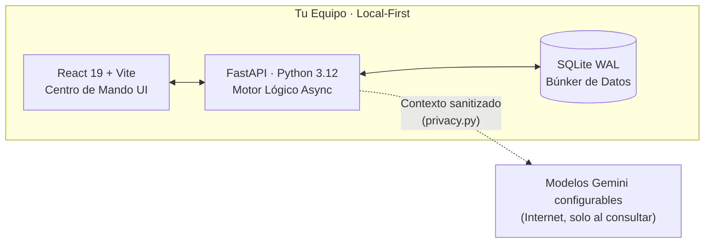

<div align="center">

# 🏛️ Tabula Rasa
### Sistema Operativo Financiero Soberano & AI-Agentic Ecosystem

*Privacidad local-first, integridad monetaria basada en centavos y asistencia opcional mediante modelos de **Google Gemini**.*

[](https://github.com/Alanjavier22/Tabula-Rasa/actions/workflows/ci.yml)
[](https://github.com/Alanjavier22/Tabula-Rasa/actions/workflows/codeql.yml)


</div>

> **"Finanzas limpias. Privacidad por diseño. Inteligencia accionable."**

Bienvenido al repositorio de **Tabula Rasa**. Es una aplicación personal de finanzas diseñada bajo el paradigma **Local-First AI**: la base financiera reside localmente en tu equipo y las funciones externas son opcionales. Gemini se utiliza en los flujos de IA cuando está configurado, mientras que Google Drive se reserva para respaldos externos explícitamente habilitados.

Este documento resume la arquitectura, las capacidades, el motor de inteligencia y la topografía de módulos del sistema. Cuando una capacidad todavía no está construida o permanece fuera de alcance, se marca explícitamente.

## 📑 Índice

1. [Arquitectura de Sistemas y Visión de Ingeniería](#arquitectura)
2. [El Ecosistema de Inteligencia Agentizada](#inteligencia-agentizada)
3. [Topografía de Módulos](#topografia-modulos)
4. [Orquestación y DevOps](#devops)
5. [Guía de Inicio Rápido](#inicio-rapido)
6. [Estructura de Directorios Clave](#estructura-directorios)
7. [Novedades y Optimizaciones Recientes](#novedades)

---

<a id="arquitectura"></a>
## 🏗️ 1. Arquitectura de Sistemas y Visión de Ingeniería

El núcleo de Tabula Rasa prioriza la integridad, la trazabilidad y la consistencia de los cálculos financieros locales.

### 🗺️ Vista de Alto Nivel



Todo lo que importa —balances, historial y deudas— vive en `DB`. La aplicación funciona localmente por defecto; las conexiones externas opcionales se limitan a los flujos de Gemini y Google Drive que el usuario configure.

### 🧬 El Stack Tecnológico y Persistencia
*   **Backend (El Motor Lógico)**: Construido en **FastAPI (Python 3.12)**. Elegido por su insuperable capacidad de procesamiento asíncrono y la validación de datos estricta mediante **Pydantic**.
*   **Frontend (Centro de Mando UI)**: Desarrollado en **React 19** impulsado por **Vite** y estandarizado con **Tailwind CSS**. La interfaz aplica principios de diseño **Glassmorphism**, es responsiva y utiliza **Framer Motion** para sus micro-interacciones.
*   **Persistencia (El Búnker de Datos)**: Emplea **SQLite en modo WAL (Write-Ahead Logging)**. A diferencia de un SQLite tradicional que bloquea la base en cada escritura, el modo WAL permite lecturas y escrituras concurrentes, combinando la ligereza de un motor local de un solo archivo con la robustez requerida para transacciones asíncronas y scripts en background.
*   **Orquestación de IA**: Router centralizado de modelos Gemini configurables. Actualmente separa tareas agentizadas, razonamiento y multimodalidad entre `gemini-3.1-flash-lite` y `gemini-3.5-flash-lite`, habilitando Vision, Function Calling y procesamiento de voz cuando el usuario configura una clave válida.

### 📐 Principios de Integridad y Robustez (Core Rules)
1.  **Aritmética de Centavos**: Los importes monetarios persistidos y los contratos financieros principales se almacenan como **enteros (centavos)**. Los servicios convierten esos valores para presentación, promedios y proyecciones cuando corresponde, evitando depender de coma flotante para registrar saldos o movimientos.
2.  **Idempotencia Criptográfica**: El motor de importación (`transaction_importer.py` y `statement_intelligence.py`) verifica duplicados antes de insertar. Genera un *hash SHA-256* a partir de la cuenta, fecha, importe, tipo, descripción, saldo corriente cuando existe y orden de ocurrencia. Si el usuario sube el mismo extracto bancario CSV o PDF varias veces, el sistema puede ignorar las filas ya identificadas.
3.  **Borrado lógico donde aplica**: La mayoría de las entidades financieras conservan registros con `is_deleted = True`, aunque existen eliminaciones físicas explícitas para algunas operaciones de administración, limpieza o restauración.
4.  **Soberanía de Datos (Local-First)**: La base financiera reside en tu disco duro y la aplicación funciona localmente por defecto. Los flujos que usan Gemini envían contexto sanitizado por `privacy.py`; los respaldos opcionales pueden enviarse a Google Drive si el usuario los configura.
5.  **Acceso local controlado**: El flujo de producto está limitado actualmente a la máquina host: CORS y pairing solo contemplan orígenes loopback, y no existe un flujo multidispositivo. El lanzador actual hace que Uvicorn escuche en `0.0.0.0`, por lo que la exposición efectiva también depende del firewall y de la red del equipo.

---

<a id="inteligencia-agentizada"></a>
## 🧠 2. El Ecosistema de Inteligencia Agentizada

La IA en Tabula Rasa no es un "chatbot" superficial: combina análisis multimodal, Function Calling y contexto financiero calculado por el backend.

### 👁️ Capacidades Multimodales y Procesamiento en Segundo Plano
1.  **Statement Intelligence (AI Vision)**: `statement_intelligence.py` procesa extractos bancarios en PDF o imágenes vía Gemini Vision. Extrae fechas de corte, pagos mínimos y desgloses de diferidos. `ai_receipts.py` cubre el análisis de recibos y el procesamiento de comandos de voz.
2.  **Sentinel Agent & Health Monitoring**: `sentinel_service.py` genera bajo demanda un "Health Score" basado en liquidez, deudas próximas y trayectoria de ahorro. La disponibilidad del endpoint no implica una vigilancia permanente en segundo plano.
3.  **AI Insights & Anomaly Detector**: `ai_insights.py` y `anomaly_detector.py` construyen análisis bajo demanda para detectar pagos duplicados, desviaciones en el "burn rate" y oportunidades de revisión financiera.
4.  **AI Audio Interface**: Integración en `ai_audio.py` y `ai_receipts.py` para procesamiento de comandos de voz y conversión de audio a transacciones.
5.  **Snapshot Reconciliation Engine**: `snapshot_reconciler.py` detecta cuándo una fotografía mensual de patrimonio neto quedó desactualizada (por ejemplo, al editar una transacción de un mes ya cerrado) y la recalcula bajo demanda, ayudando a mantener actualizado el historial.
6.  **AI Goal Optimization**: `backend/app/api/ai_goals.py` calcula tu "Safe-to-Spend" real y, solo cuando detecta un excedente saludable, solicita a Gemini una distribución conservadora para las metas activas con instrucciones de no exceder el monto pendiente.

### 🎭 Las 6 Personalidades del Cerebro Financiero
El orquestador de chat de la aplicación adapta su comportamiento estructural, léxico y profundidad de razonamiento según la faceta de asesoría que selecciones:

1.  **🕵️‍♂️ Analista Senior (Forense Financiero)**:
    *   *Propósito*: Auditoría profunda, detección de anomalías y resolución de problemas.
    *   *Comportamiento*: Trata tus estados de cuenta como una escena del crimen y tu dinero perdido como "el sospechoso". Busca discrepancias lógicas, correlaciones ocultas y fugas de capital estructurales. Es el modo a elegir para encontrar el "por qué" de una caída drástica en la liquidez.
2.  **🔥 Modo Roast (Comedia Negra Financiera)**:
    *   *Propósito*: Disciplina conductual a través de la vergüenza cómica.
    *   *Comportamiento*: Brutalmente honesto y sarcástico. Utiliza tus propios datos para ridiculizar tus peores decisiones. Si gastas dinero en salidas teniendo deudas de tarjetas de crédito, el Roast tomará tus números reales y creará analogías humillantes e impredecibles para forzar disciplina psicológica.
3.  **🎮 RPG Master (Game Master)**:
    *   *Propósito*: Gamificación de la economía personal para perfiles jóvenes o lúdicos.
    *   *Comportamiento*: Transforma tus finanzas en una campaña de rol épica. Tu saldo líquido es tu barra de vida ("HP"), tus metas son "Misiones Principales", tus gastos impulsivos son "Debuffs de Estado" o ataques de monstruos. Si ahorras, estás "farmeando oro". La inmersión es total.
4.  **⚡ Motivador Personal (Coach de Élite)**:
    *   *Propósito*: Optimización agresiva del rendimiento financiero y empoderamiento.
    *   *Comportamiento*: Enérgico, exigente e inspirador. Compara tu salud financiera con un deporte de alto rendimiento. Te empuja a ahorrar más agresivamente y te obliga a ver cada dólar como un soldado que debe trabajar para ti. Termina cada consulta imponiendo un "ejercicio financiero del día" específico a tus números.
5.  **🧘 Maestro Zen (Sabio Milenario)**:
    *   *Propósito*: Conciencia, reflexión y paz financiera.
    *   *Comportamiento*: Poético y profundo. Ve el dinero como una energía puramente fluida. Sus respuestas buscan el equilibrio entre el disfrute del presente y la seguridad del futuro, promoviendo el desapego y la reducción drástica de la ansiedad económica.
6.  **📊 Analista Profesional**:
    *   *Propósito*: Eficiencia operativa pura para decisiones de negocios.
    *   *Comportamiento*: La configuración base. Tono ejecutivo, sobrio y directo. Cero adornos literarios, 100% centrado en datos accionables, retorno de inversión y métricas duras.

### 🛠️ El Arsenal de Herramientas de IA (Function Calling)
La IA de Tabula Rasa tiene **estrictamente prohibido alucinar sumas matemáticas**. Para razonar, tiene a su disposición un arsenal de **22 funciones (Tools)** que ejecutan consultas SQL complejas en el backend para proporcionarle contexto en tiempo real:

| Categoría | Funciones Expuestas al LLM | Propósito Operativo |
| :--- | :--- | :--- |
| **Flujo de Caja** | `get_cash_flow_context`, `get_monthly_summary` | Permitir a la IA leer el flujo de caja actual y comparar el desempeño mensual histórico sin sumar cifras a ciegas. |
| **Auditoría** | `get_audit_report`, `get_duplicate_transactions`, `get_recent_transactions`, `get_import_history` | Extraer transacciones huérfanas, candidatos a duplicidad, patrones de "quemado" de fondos inmediatos e historial de extractos ya importados. |
| **Búsqueda / Resolución** | `search_categories`, `search_accounts` | Resolver UUIDs semánticamente cuando el usuario pregunta por "comida" o "banco pichincha". |
| **Control de Gastos** | `get_budget_status`, `get_all_budgets_status` | Analizar porcentajes de consumo de presupuesto para alertar desviaciones de la meta mensual. |
| **Obligaciones Fijas** | `get_active_subscriptions`, `get_upcoming_reminders` | Analizar compromisos ineludibles que la IA debe restar de tu "Safe-to-Spend" real. |
| **Metas y Ahorro** | `get_active_goals` | Consultar el progreso real de tus metas activas antes de sugerir una reasignación de excedente. |
| **Patrimonio Integral** | `get_assets_context`, `get_net_worth_history`, `get_debt_summary`, `get_total_balance`, `get_account_balance` | Entender la riqueza global, la carga de deudas personales (IOUs) y el desempeño del patrimonio neto ("Net Worth") a lo largo del tiempo. |
| **Inteligencia Fiscal/Alta** | `get_fiscal_summary`, `get_financial_executive_summary`, `get_sentinel_health`, `get_credit_card_details` | Ejecutar proyecciones del IVA, revisar el "Health Score" global del Sentinel y evaluar riesgos en fechas de corte de tarjetas de crédito. |

### 🛡️ Políticas de Blindaje y Seguridad del Prompting
*   **Read-Only Strict Enforcement**: La IA es fundamentalmente un auditor inteligente, no un ejecutor a ciegas. Las funciones expuestas al LLM son de consulta y cálculo; no incluyen acciones de escritura o mutación. Si el motor infiere que debes crear una nueva meta financiera o ajustar un presupuesto, te lo sugerirá verbalmente, pero el usuario debe ser quien realice la acción mediante la interfaz.
*   **Zero-Arithmetic Rules**: Instrucciones sistémicas explícitas prohíben a la IA realizar aritmética profunda. Si requiere un total, se le obliga a llamar a una función del backend.
*   **Time-Context Injection**: El sistema inyecta la fecha, hora y zona horaria (`America/Guayaquil`) en el prompt del sistema antes de cada turno para dar contexto temporal a las respuestas y evaluaciones de vencimientos.

---

<a id="topografia-modulos"></a>
## 🗺️ 3. Topografía de Módulos (Rayos X Operativo)

El frontend de Tabula Rasa reúne 12 módulos de negocio especializados, más capas transversales de infraestructura como la navegación, el cliente de API y la presentación visual.

### 📈 1. Panel de Control (Dashboard Estratégico)
El centro de mando neurálgico diseñado para la toma de decisiones inmediatas.
*   **Métrica Estrella: Safe-to-Spend**: No te dice "cuánto hay", te dice cuánto puedes gastar hoy. El algoritmo cruza saldos, presupuestos comprometidos, suscripciones próximas y un colchón de seguridad.
*   **Suite de Visualización Financiera**: Batería de gráficos dedicados (`NetWorthChart`, `CashFlowForecastChart`, `ExpenseBreakdownChart`, `IncomeExpenseBarChart`, `DailySpendingChart`) que cruzan ingresos, gastos, deudas y patrimonio neto desde ángulos complementarios en vez de un único gráfico genérico.
*   **Sentinel Health Indicator**: Widget que muestra el estado calculado por Sentinel sobre la integridad de los datos y distintos indicadores financieros.
*   **Simulador What-If**: Proyecta escenarios hipotéticos (ej. compras grandes o préstamos) para ver su impacto en la liquidez futura a 12 meses.

### 💸 2. Transacciones e Inteligencia de Importación
*   **Idempotencia Criptográfica (SHA-256)**: Las transacciones importadas reciben un fingerprint y se comparan con los registros existentes para detectar duplicados.
*   **Categorización por Patrones Aprendidos**: Motor de reglas semánticas (`categorizer.py`) que conserva correcciones manuales —por descripción y beneficiario— para mejorar la clasificación de movimientos futuros similares.
*   **Sistema de Splits (Divisiones)**: Permite desglosar un solo pago (ej. supermercado) en múltiples categorías (Alimentación, Hogar, Mascotas).
*   **Internal Transfer Logic**: Marca movimientos entre cuentas propias para evitar la inflación artificial de las métricas de gasto.

### 🏛️ 3. Módulo Fiscal SRI (Asistencia Proactiva)
*   **Clasificador de Rubros Deducibles**: Mapeo automático de gastos hacia categorías de referencia del SRI (Salud, Educación, Vivienda, Alimentación, Vestimenta).
*   **Exportación de datos**: Generación de archivos **XML y JSON** para apoyar la preparación de información tributaria; deben revisarse antes de presentarlos ante el SRI.

### 💳 4. Cuentas y Tarjetas (Account Intelligence)
*   **Diferenciación de Naturaleza**: Gestión separada de cuentas líquidas (Checking/Savings) y líneas de crédito.
*   **Net Worth Engine**: Cruce automático de saldos contra pasivos de tarjetas para obtener la posición neta consolidada.
*   **Ciclos de Corte**: Inteligencia que mueve gastos entre meses lógicos basados en fechas de corte y no solo meses calendario.

### 🎯 5. Metas de Ahorro e Inversión
*   **Recomendaciones Inteligentes de Aporte**: Cuando detecta un excedente real en tu "Safe-to-Spend", la IA sugiere cuánto mover a cada meta activa mediante una distribución conservadora con límites sobre el monto pendiente.
*   **Visualización de Progreso**: Tracking dinámico de contribuciones, montos objetivo y estados de cumplimiento por meta.

### 📊 6. Presupuestos Operativos
*   **Burning Rate dinámico**: Barras de progreso con lógica de semáforo que alertan si tu ritmo de gasto diario superará el techo mensual antes de tiempo.
*   **Presupuestos por Categoría**: Control granular del flujo de salida de efectivo.

### 🕰️ 7. Recordatorios y 📱 8. Suscripciones
*   **Deducción Preventiva**: Estas obligaciones no son solo avisos; el sistema las descuenta virtualmente de la liquidez disponible para reservar ese dinero frente a próximos cobros.
*   **Análisis de Fugas**: Identificación de suscripciones olvidadas o duplicadas.

### 🤝 9. Economía Colaborativa (IOUs & Debt Shares)
*   **Gestión P2P (IOUs)**: Registro dual de dinero prestado y adeudado a terceros (amigos, familiares).
*   **Debt Shares**: Consolidador de gastos compartidos. Si pagas una cuenta grupal, el sistema vincula los reembolsos de tus amigos a la deuda original de tu tarjeta, manteniendo tu balance personal intacto.

### 🏎️ 10. Telemetría Vehicular — ⚠️ Parcial
Existe una capa de métricas derivada de transacciones categorizadas como combustible y mantenimiento, expuesta por `/metrics/vehicle-telemetry` y visible en el Dashboard. Todavía no existe un módulo de primer nivel con modelos backend `Vehicle`/`FuelLog`/`MaintenanceLog`, migraciones ni una página dedicada; la gestión completa de vehículos permanece en roadmap.

### 📸 11. Snapshots y Patrimonio Neto (Net Worth)
*   **Fotografía Mensual**: Conserva activos, pasivos y patrimonio neto por período; la reconciliación de snapshots obsoletos está disponible bajo demanda y la creación autónoma de snapshots permanece desactivada actualmente.
*   **Depreciación de Activos (`asset_depreciation.py`)**: Aplica amortización temporal a bienes físicos (autos, tech, propiedades) para que tu patrimonio neto sea una realidad financiera dura y no una ilusión.

### 📂 12. Categorías y Personalización Semántica
*   **Taxonomía Flexible**: Gestión de iconos, colores y reglas de mapeo que alimentan al motor de IA para una clasificación consistente.

### 🔗 13. Vinculación Multidispositivo — 🚧 Fuera de alcance actual
*   El acceso se mantiene limitado a la máquina host. El pairing por PIN y QR para móviles/tablets queda reservado para una fase posterior, cuando exista una necesidad de producto concreta.

### ⚡ 14. Navegación y UI Fluida
*   **Menú Lateral Colapsable**: Implementación de navegación lateral contraíble con persistencia en `localStorage`. Cuenta con un modo compacto iconográfico, logo inteligente sintetizado `"T R"`, tooltips contextuales flotantes de alta gama y micro-interacciones hover.
*   **Transiciones de layout**: Uso selectivo de `will-change` y animaciones de Framer Motion en la navegación y los modales para mejorar la percepción de fluidez sin prometer un rendimiento fijo en todos los equipos.
*   **Modales en AnimatePresence**: Integración del ciclo de vida de desmontado de Framer Motion en los modales de **Auditoría Forense IA** e **Importación de Estados de Tarjetas**, con transiciones de entrada y salida coherentes.


---

<a id="devops"></a>
## 🚀 4. Orquestación y DevOps (Zero-Friction Setup)

La instalación y operación local se coordinan desde el script maestro de PowerShell `menu.ps1`, acompañado por lanzadores para Windows y otros entornos.

### ⚙️ Capacidades del Motor de Orquestación (`menu.ps1`)
1.  **Auto-Provisioning y Fallback Autónomo**: Apenas arranca, el script detecta y desactiva los ejecutables fantasma de la Windows Store que secuestran el comando `python`. Escanea el PATH buscando **Python 3.12+** y **Node.js**. Si no los encuentra, intenta instalarlos de forma silenciosa con `Winget`. Si `Winget` no está disponible o falla, realiza una **descarga directa e instalación silenciosa** desde los repositorios oficiales de Python y Node.js de forma totalmente autónoma.
2.  **Aceleración con `uv` y Fallback a `pip`**: Tras garantizar Python en el sistema, el script intenta usar `uv` para instalar las dependencias de `requirements.txt`; si falla, vuelve automáticamente a `pip`.
3.  **Self-Healing (Curación Automática)**: Cada vez que presionas "Iniciar Aplicativo", el script lanza rutinas de test silenciosas. Intenta importar de forma subyacente librerías críticas (`pydantic`, `sqlalchemy`, `fastapi`, `jwt`). Si detecta un "ImportError" (indicando que tu entorno virtual `venv` está corrupto o carece de bibliotecas), el script destruye el `venv` agresivamente y lo vuelve a ensamblar desde cero de manera invisible. Siempre arrancarás en un entorno inmaculado.
4.  **Asesino de Zombies (Port Management Quirúrgico)**: Si cerraste bruscamente el terminal en el pasado y los procesos de servidor quedaron atrapados como "zombies" devorando recursos, el script ejecuta un barrido TCP, localiza el PID exacto que secuestró los puertos `8001` y `5173`, y ejecuta un `Stop-Process -Force` para liberarlos, previniendo el temido error "Address already in use".
5.  **Observabilidad en Tiempo Real**: El menú 3 ("Ver Logs") implementa un bucle dinámico que emula el comando `tail -f` de los servidores Linux. Permite al usuario monitorizar las salidas estándar e interceptar errores tanto del motor de FastAPI como de Vite/React de forma simultánea sin interrumpir su ejecución principal en background.

### 🔁 Integración continua, seguridad y releases en GitHub

El repositorio incluye validación automática en `.github/workflows/ci.yml` y análisis de seguridad en `.github/workflows/codeql.yml`. GitHub Actions ejecuta, sin utilizar la API de Gemini ni datos del usuario:

* **Backend**: instalación reproducible, `pytest`, `pip check` y comprobación de deriva con Alembic.
* **Frontend**: `npm ci`, lint estricto y build de producción.
* **Seguridad**: CodeQL para Python y JavaScript/TypeScript.

El workflow se ejecuta en Pull Requests hacia `main`, en pushes a `main` y manualmente; CodeQL también tiene una ejecución semanal. Para el chequeo de esquema, CI inicializa la base con los modelos actuales y ejecuta `alembic stamp head` antes de `alembic check`, porque la cadena histórica contiene migraciones que no pueden arrancar sobre una SQLite vacía.

La rama `main` está protegida: los cambios entran por Pull Request y requieren los checks de backend y frontend aprobados. El release vigente es [v0.1.0 — Primera versión operativa](https://github.com/Alanjavier22/Tabula-Rasa/releases/tag/v0.1.0). Las releases se preparan mediante tags Git y notas agrupadas desde `.github/release.yml`; los respaldos, bases de datos y secretos no deben incluirse en una release.

Para reportar una vulnerabilidad, consultar [SECURITY.md](SECURITY.md). Para cambios de código, utilizar Pull Requests e Issues sin adjuntar información financiera real.

---

<a id="inicio-rapido"></a>
## 🛠️ 5. Guía de Inicio Rápido (Para Usuarios y Desarrolladores)

### Requisitos Mínimos del Hardware
*   **Sistema Operativo**: Windows 10/11 con PowerShell.
*   **Memoria RAM**: 4GB Mínimo (8GB Recomendado para un entorno React fluido).
*   **Conexión a Internet**: No requerida para el núcleo local una vez instaladas las dependencias; necesaria para el auto-provisioning, Gemini y respaldos externos en Google Drive.

### Instalación en 1 Paso
El objetivo de este proyecto es que su levantamiento no requiera conocimientos de programación.
1.  **Paso 1**: Descarga o clona este repositorio en tu máquina.
    ```bash
    git clone https://github.com/Alanjavier22/Tabula-Rasa.git
    ```
2.  **Paso 2**: En tu explorador de archivos de Windows, haz doble clic en el archivo **`menu.bat`**. (O ejecuta `.\menu.ps1` desde una terminal si eres un usuario avanzado).
3.  **Paso 3**: El sistema orquestador se encargará de instalar todo lo necesario, configurará las variables de entorno, levantará el backend y el frontend, y abrirá una ventana en tu navegador por defecto apuntando a: `http://localhost:5173`.
4.  **Paso 4**: El sistema te pedirá añadir la clave de la API de Gemini en la pantalla de Configuración para desbloquear los módulos de IA.

Si necesitas levantar el backend manualmente, ejecútalo desde `backend` con `venv\Scripts\python.exe -m uvicorn main:app`. El Python global solo se usa para crear o reparar ese entorno virtual; las dependencias de la aplicación, incluido `PyJWT`, viven dentro de `backend\venv`.

---

<a id="estructura-directorios"></a>
## 📂 6. Estructura de Directorios Clave

```text
TABULA-RASA/
├── backend/                       # Motor Lógico y Base de Datos (Python/FastAPI)
│   ├── app/
│   │   ├── api/                   # Controladores RESTful
│   │   ├── models/                # Modelos ORM (SQLAlchemy)
│   │   └── services/              # Lógica de Negocios, Orquestación IA y Telemetría
│   ├── main.py                    # Punto de entrada de la aplicación
│   └── requirements.txt           # Dependencias de Python
├── frontend/                      # Centro de Control Visual (React/Vite)
│   ├── src/
│   │   ├── components/            # Elementos reutilizables UI (Glassmorphism)
│   │   ├── pages/                 # Páginas de los módulos funcionales
│   │   └── services/              # Clientes de API y servicios de frontend
│   ├── index.css                  # Framework de estilos Tailwind
│   └── package.json               # Dependencias de Node
├── .agents/                       # Contexto persistente y habilidades locales
├── menu.ps1                       # 🧠 Orquestador Industrial de DevOps
├── menu.bat                       # Lanzador de conveniencia para Windows
└── README.md                      # Este manifiesto
```

---
<a id="novedades"></a>
## 🛠️ 7. Novedades y Optimizaciones Recientes (Estabilidad & Rendimiento)

Recientemente se ha implementado un paquete masivo de estabilidad y calidad de código:
*   **Aseguramiento de Tipos (TS Estricto)**: El frontend mantiene una compilación de producción (`npm run build`) limpia y validada por CI.
*   **Lazy Loading & Route Splitting**: Implementación de carga perezosa (`React.lazy()`) y suspensión de rutas para acelerar el tiempo de carga del Dashboard.
*   **Sidebar Colapsable de Alto Impacto**: Un panel lateral completamente colapsable en desktop que persiste su estado en el `localStorage` para mejorar la superficie útil del dashboard.
*   **Parseador de Fechas Universal (`parse_date_robustly`)**: Módulo defensivo en el backend que normaliza discrepancias de fecha/hora de bases de datos locales (SQLite) o payloads erráticos, reduciendo errores en importaciones.
*   **Autogestión de JWT_SECRET**: Generación automática de llaves secretas en el archivo `.env` cuando el backend prepara su configuración.
*   **Filtros de Blacklist Dinámicos en DB**: Reemplazo de palabras clave fijas por consultas dinámicas a la tabla de configuración.
*   **Migración Completa a Pydantic v2**: Transición de toda la serialización del backend a `.model_dump()`.

---
> **HISTORIAL DE INGENIERÍA**: 
> Te invitamos a leer el archivo **`HISTORIAL.md`** adjunto en este repositorio para comprender a detalle el progreso cronológico de las optimizaciones, resoluciones de bugs, "refactorings" de código y las decisiones arquitectónicas clave (ADRs) documentadas semana a semana a lo largo de este proyecto de alto calibre.

---
Desarrollado con ☕ y 🧠 por **Alan Javier Mejia Alvarez**
*Soberanía financiera, precisión técnica y privacidad por diseño.* 🏛️✨

