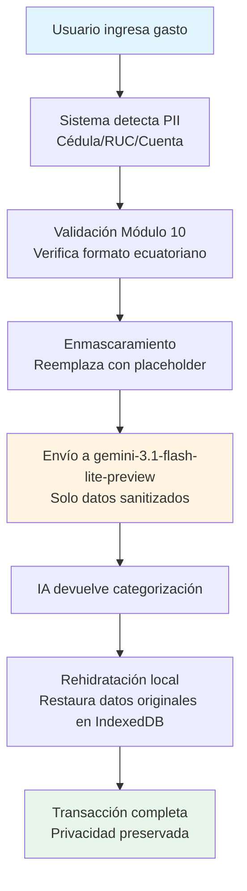
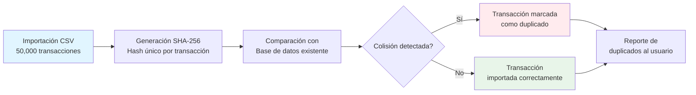

# 🏛️ Tabula Rasa: Local-First Financial Operating System

**La soberanía absoluta de tus finanzas. Privacidad blindada, integridad matemática y latencia cero.**


---

## 📖 Filosofía Local-First: Soberanía del Dato

**Tus datos te pertenecen. Punto.**

Tabula Rasa rechaza el modelo SaaS donde tus datos financieros viven en servidores de terceros. En su lugar, implementamos una arquitectura **Thin Client** donde:

- **Backend como Fuente de Verdad**: FastAPI + SQLite en modo WAL es tu base de datos local (Single Source of Truth)
- **Frontend Thin Client**: Cliente ligero que consulta datos vía HTTP sin almacenamiento local persistente
- **Offline-Ready**: Carga inicial desde backend, React Query cache en memoria para reactividad
- **Zero-Knowledge AI**: La IA solo ve datos sanitizados (Cédulas/RUCs enmascarados antes del envío)
- **Google Drive Backup**: Backups automáticos en la nube con rotación inteligente

---

## 🏗️ Los 4 Pilares de la Ingeniería en Tabula Rasa

### 💎 Integridad Monetaria

**Inmunidad total a los errores de redondeo IEEE 754.**

Imagina que estás calculando el interés compuesto de tu inversión a 5 años. Un error de redondeo de 0.0001 centavos puede acumularse en cientos de dólares. Tabula Rasa usa tipos nominales (`Cents`) y aritmética de precisión arbitraria para garantizar que cada centavo cuente exactamente, sin sorpresas matemáticas.

### 🛡️ Blindaje Zero-Knowledge: Privacidad Absoluta

**Sanitización exhaustiva antes de enviar datos a la API.**

Cuando ingresas un gasto, el sistema intercepta automáticamente cualquier información personal sensible (Cédulas, RUCs, números de cuenta) y la enmascara usando validación Módulo 10. Solo entonces viaja al modelo de IA, y el sistema "rehidrata" el dato localmente en IndexedDB después de recibir la respuesta.



### ⏳ Identidad Determinista

**Sin colisiones, incluso al importar 50,000 transacciones.**

Imagina que exportas un CSV de tus consumos en Sweet & Coffee o el pago de tu membresía del gimnasio desde tu banco y lo importas dos veces por accidente. Tabula Rasa genera un hash criptográfico único para cada transacción, detectando la colisión y evitando cobros duplicados mágicamente, incluso si importas 50,000 registros de golpe.



### ⏱️ Autoconciencia Temporal

**Si alteras el pasado, el presente se invalida automáticamente.**

Cuando corriges una transacción histórica (por ejemplo, cambias el monto de un gasto de hace 6 meses), Tabula Rasa detecta automáticamente que los snapshots de patrimonio neto están desactualizados. El sistema los marca como obsoletos y los recalcula en segundo plano, garantizando que tus proyecciones de Cash Flow siempre se basen en datos consistentes.

---

## 🚀 Innovaciones Técnicas

### 🧠 Motor de IA: gemini-3.1-flash-lite-preview

**Inteligencia artificial sin comprometer la soberanía del dato.**

Tabula Rasa integra gemini-3.1-flash-lite-preview como un asistente invisible que trabaja en segundo plano. La IA analiza patrones en tus transacciones para:

- **Categorización automatizada**: Clasifica gastos e ingresos basándose en descripciones bancarias
- **Detección de anomalías**: Identifica patrones de consumo inusuales que podrían indicar fraudes o errores
- **Cash Flow Forecast**: Proyecta tu liquidez disponible para los próximos 30, 60 y 90 días

Lo más importante: tus datos reales nunca salen de tu máquina. El sistema sanitiza toda información personal antes de enviarla a la IA, y solo recibe categorizaciones y patrones abstractos como respuesta.

**Caso de uso real**: Estás planeando comprar un vehículo a fin de año usando tus bonos o décimos. El Cash Flow Forecast analiza tus patrones de gastos históricos, proyecta tu flujo de caja futuro y te dice exactamente cuánto capital podrás abonar a la deuda vehicular en diciembre, todo esto sin que tus datos financieros reales salgan de tu computadora.

### Protocolo Phoenix: Autocorrección de Entorno y Base de Datos

**El sistema se cura solo al arrancar y durante la operación.**

Tabula Rasa incluye un sistema de auto-curación multicapa:

#### Backend: Phoenix DB Healer
- **Auto-cura de esquema**: Detecta columnas faltantes en SQLite y las agrega automáticamente
- **Mapeo de tipos**: Convierte tipos SQLAlchemy a tipos SQLite automáticamente
- **Logging transparente**: Registra todas las acciones de curación con prefijo [Phoenix DB Healer]

#### Frontend: Phoenix Local Healer
- **Hard Reset de IndexedDB**: Elimina base de datos corrupta y recarga página
- **Contador de Pánico**: Dispara reset automático tras 3 fallos consecutivos de esquema en 1 minuto
- **Health Check Proactivo**: Verifica funcionalidad de base de datos tras apertura
- **Interceptador Global**: Captura promesas Dexie no manejadas para evitar errores silenciosos
- **Evento phoenix-fatal-error**: Permite activación externa desde servicios de fondo
- **FASE 5**: Exportación de JSON de emergencia a localStorage antes de hard reset
- **FASE 7**: Fallback a descarga Blob si backup > 4MB (evita overflow de localStorage)

**Flujo de auto-curación:**
1. Al arrancar, detecta y limpia puertos zombies (8001, 5173)
2. Valida integridad del entorno virtual
3. Reinstala dependencias automáticamente si están corruptas
4. Inicia backend y frontend en el orden correcto
5. Ejecuta health check de base de datos
6. Si detecta corrupción, activa Phoenix Local Healer
7. Espera hasta que el backend esté saludable antes de abrir el navegador

### Storage Guardian: Monitoreo Proactivo de Cuota

**Alerta al 80%, crítico al 95%. Nunca te sorprenda sin espacio.**

El sistema monitorea continuamente el uso de almacenamiento del backend SQLite. Cuando alcanzas el 80% de cuota, recibes una advertencia. Al 95%, el sistema entra en modo crítico y activa automáticamente la rotación de backups para liberar espacio.

### ⚡ Lógica Avanzada: Telemetría y Depreciación

**Cálculo de activos y reportes multidivisa con precisión bancaria.**

Tabula Rasa incluye herramientas contables profesionales:

- **Depreciación de activos**: Cálculo automático con métodos estándar (línea recta, saldo decreciente)
- **Reportes multidivisa**: Balance sheet con conversión en tiempo real entre USD, EUR y otras monedas
- **Telemetría anónima**: Métricas de uso y rendimiento sin información personal identificable

### Higiene de Memoria: Exportación via Streaming

**50,000+ transacciones sin congelar la interfaz.**

Cuando exportas tu historial financiero completo, Tabula Rasa usa streaming para procesar los datos en chunks de 500 registros. Esto significa que puedes exportar 50,000 transacciones a CSV sin que la interfaz se congele, incluso en computadoras con recursos limitados.

---

## ✨ Core Features

### Dashboards Reactivos
- **Dashboard Principal**: Tarjetas de resumen, transacciones recientes, breakdown de gastos
- **Cash Flow Forecast**: Proyección a 30/60/90 días con detección de saldos negativos
- **Safe to Spend**: Cálculo inteligente de presupuesto disponible considerando gastos fijos, deudas y proyecciones estacionales

### Parsers Bancarios Inteligentes (Ecuador)
Soporte nativo para los principales bancos ecuatorianos:
- **Banco Pichincha**: FECHA, DESCRIPCION, DEBITO, CREDITO
- **Banco Guayaquil**: FECHA, CONCEPTO, VALOR
- **Banco Pacífico**: FECHA TRANSACCION, DESCRIPCION, ABONO, CARGO
- **Parser genérico**: Fallback inteligente para otros formatos

### Búsqueda Avanzada con Normalización Unicode
Búsqueda insensible a tildes y diacríticos. "pago" coincide con "págó", "pagó", "PÁGO" — todas las variaciones funcionan gracias a la normalización Unicode NFD.

### Presupuestos Recurrentes Dinámicos
- **Generación por API**: Crea presupuestos recurrentes para cualquier mes/año vía POST /api/budgets/generate-recurring
- **Actualización Inteligente**: PUT /api/budgets/update-recurring para modificar presupuestos existentes
- **Rotación Automática**: Sistema elimina presupuestos del mes anterior al generar nuevos
- **UI Integrada**: Botón "Generar Recurrente" en página de Presupuestos con selección de mes/año

### Importación de Transacciones por Lote
- **API de Importación**: POST /api/transactions/import-batch para importar múltiples transacciones
- **Detección de Duplicados**: Opción para omitir transacciones duplicadas basándose en descripción, monto y fecha
- **Validación Robusta**: Valida categorías, cuentas y formato de fechas antes de importar
- **Reporte de Resultados**: Retorna conteo de importadas, omitidas y fallidas con mensajes de error

---

## 📁 Arquitectura del Sistema

Tabula Rasa utiliza una arquitectura híbrida que combina lo mejor de dos mundos:

```mermaid
flowchart TB
    subgraph Frontend["Frontend (React + TypeScript)"]
        A[UI Components<br/>Dashboards & Forms]
        B[React Query Cache<br/>In-memory volátil]
        C[Privacy Layer<br/>Sanitización PII]
        D[API Client<br/>HTTP Requests]
    end

    subgraph Backend["Backend (FastAPI + Python)"]
        E[REST API<br/>Endpoints seguros]
        F[SQLite WAL<br/>Base de datos local (SSOT)]
        G[AI Integration<br/>gemini-3.1-flash-lite-preview]
        H[Analytics Engine<br/>Cash Flow Forecast]
        I[Backup Service<br/>Google Drive API]
    end

    A --> B
    A --> C
    C --> D
    D --> E
    E --> F
    E --> G
    E --> H
    E --> I

    style Frontend fill:#e1f5ff
    style Backend fill:#fff4e1
    style B fill:#fff9c4
    style F fill:#e8f5e9
    style G fill:#fce4ec
    style I fill:#fff3cd
```

**Flujo de datos:**
1. **Frontend** maneja toda la lógica de UI y realiza peticiones HTTP al backend
2. **Privacy Layer** sanitiza datos antes de cualquier comunicación externa
3. **API Client** realiza peticiones HTTP directas al backend (sin cola de sincronización)
4. **Backend** proporciona API REST, análisis avanzado e integración con IA
5. **SQLite WAL** es la Single Source of Truth y asegura concurrencia sin bloqueos
6. **Google Drive Backup** sube dumps de base de datos a la nube con rotación automática

---

## 💾 Google Drive Backup Integration

**Backups automáticos en la nube con rotación inteligente.**

Tabula Rasa incluye integración nativa con Google Drive para backups automáticos de la base de datos:

- **Configuración OAuth**: Gestión de credenciales (client_id, client_secret, refresh_token) vía API
- **Subida Automática**: Backups programados via APScheduler
- **Rotación Inteligente**: Mantiene solo los últimos 30 backups en Google Drive
- **Folder Específico**: Backups se almacenan en carpeta "tabula_rasa_backup"
- **Fail-Soft**: Si las credenciales no están configuradas, el sistema logga advertencia y continúa sin interrumpir la aplicación
- **Nombre de Archivo**: Formato `tabula_rasa_backup_YYYYMMDD_HHMMSS.sqlite3`

**Flujo de Backup:**
1. Sistema genera dump local de SQLite
2. Autentica con Google Drive usando OAuth refresh token
3. Crea/verifica carpeta "tabula_rasa_backup" en Drive
4. Sube archivo con subida reanudable
5. Lista backups existentes y elimina los más antiguos (mantiene 30)
6. Limpia dump local
7. Registra todas las operaciones con prefijo [GOOGLE_DRIVE]

---

## ⚡ Instalación en 30 Segundos

### Requisitos Previos
- **Python 3.12+** (validado automáticamente)
- **Node.js 18+**
- **Windows PowerShell**

### Instalación Automática (Recomendado)

```powershell
# Ejecutar en PowerShell (preferiblemente como Administrador)
.\menu.ps1
```

El script `menu.ps1` maneja todo automáticamente:

1. ✅ **Valida Python 3.12+** (aborta si es incompatible)
2. ✅ **Limpia puertos zombies** (mata procesos en 8001/5173)
3. ✅ **Crea entorno virtual** si no existe
4. ✅ **Instala dependencias con uv** (10-100x más rápido que pip)
5. ✅ **Valida integridad del backend** (reinstala si está corrupto)
6. ✅ **Inicia backend** (FastAPI en puerto 8001)
7. ✅ **Health Check Polling** (espera hasta que backend responda)
8. ✅ **Instala dependencias Node** si faltan
9. ✅ **Inicia frontend** (Vite en puerto 5173)
10. ✅ **Abre navegador** automáticamente en `http://localhost:5173`

### Instalación Manual (Si prefieres control total)

#### Backend
```bash
cd backend
python -m venv venv
venv\Scripts\activate
pip install uv
uv pip install -r requirements.txt
uvicorn main:app --host 0.0.0.0 --port 8001
```

#### Frontend
```bash
cd frontend
npm install
npm run dev
```

---

## 🔧 Stack Tecnológico

### Backend
- **Python 3.12+** con FastAPI (framework web moderno y asíncrono)
- **SQLite** en modo WAL (Write-Ahead Logging para concurrencia sin bloqueos)
- **SQLAlchemy** ORM con Alembic migrations (gestión de esquema robusta)
- **UUIDv5** para identidad determinista (mismo input = mismo UUID siempre)
- **Cryptography** para hashing SHA-256 (integridad de datos)
- **FASE 8**: TLS local con certificados auto-firmados (HTTPS en LAN)
- **FASE 8**: RotatingFileHandler para logs (10MB max, 5 backups)

### Frontend
- **React 18** con TypeScript (tipado estático para seguridad)
- **Vite** (build tool ultrarrápido con HMR instantáneo)
- **Dexie.js** (wrapper de IndexedDB con API promisada)
- **Decimal.js-light** (precisión monetaria arbitraria)
- **TailwindCSS** (styling utility-first para desarrollo rápido)
- **Lucide React** (iconos modernos y consistentes)
- **FASE 8**: Heartbeat de integridad automático (ejecuta cada 24h con requestIdleCallback)

---

## 🎯 ¿Por qué Tabula Rasa es diferente?

| Característica | Apps SaaS Comunes | Tabula Rasa |
|---------------|------------------|-------------|
| **Propiedad de datos** | Servidores de terceros | Backend local (SQLite) |
| **Offline** | Requiere internet | Offline-ready (carga desde backend) |
| **Privacidad IA** | Datos crudos a la nube | Zero-Knowledge (sanitizado) |
| **Precisión monetaria** | Float IEEE 754 (errores) | Decimal (precisión bancaria) |
| **Backup** | En la nube (sin control) | Google Drive (control total) |
| **Importación masiva** | Crash >10k registros | Streaming 50k+ sin freeze |
| **Auto-reparación** | Manual | Protocolo Phoenix automático |

---

## 🌟 Posicionamiento en el Mercado

### Nivel Técnico: Enterprise-Grade para Usuarios Individuales

Tabula Rasa opera en un nivel técnico comparable a sistemas financieros empresariales, pero diseñado para uso personal. Combina prácticas de ingeniería de producción con la simplicidad de una aplicación personal.

**Comparación con Sistemas Financieros Actuales:**

| Aspecto | Software Contable Tradicional | Apps Financieras SaaS | Tabula Rasa |
|---------|------------------------------|----------------------|-------------|
| **Arquitectura** | Monolítica, on-premise | Cloud-native, multi-tenant | Local-First híbrido |
| **Latencia** | Alta (servidor local) | Media (roundtrip cloud) | Cero (datos locales) |
| **Privacidad** | Control total (si auto-hosteado) | Baja (datos en cloud) | Máxima (Zero-Knowledge) |
| **Offline** | Dependiente de red | Limitado o nulo | Completo |
| **Costo** | Alto (licencias + infraestructura) | Suscripción mensual | Gratis (auto-hosteado) |
| **Actualizaciones** | Manual, complejas | Automáticas, forzadas | Automáticas, opcionales |
| **IA Integrada** | Rara vez o básica | Variable, datos en cloud | Avanzada, Zero-Knowledge |

### Ventajas Competitivas Únicas

**1. Privacidad sin Sacrificar Funcionalidad**
A diferencia de las apps SaaS que requieren enviar tus datos a la nube para usar IA, Tabula Rasa sanitiza localmente antes de cualquier comunicación externa. Obtienes el poder de gemini-3.1-flash-lite-preview sin exponer tu información financiera.

**2. Resiliencia Operativa**
El Protocolo Phoenix asegura que el sistema se recupere automáticamente de corrupciones de entorno, algo que ni el software contable tradicional ni las apps SaaS ofrecen. Tu sistema financiero nunca queda "roto" por una actualización fallida.

**3. Escalabilidad Local**
Puedes importar 50,000+ transacciones sin que la interfaz se congele, gracias a streaming y buffers inteligentes. La mayoría de las apps SaaS fallan con importaciones masivas de más de 10,000 registros.

**4. Precisión Bancaria Garantizada**
Mientras que las apps SaaS comunes usan float IEEE 754 (propenso a errores de redondeo), Tabula Rasa implementa tipos nominales y aritmética de precisión arbitraria. El mismo nivel de precisión que los sistemas bancarios core.

### En Resumen

Tabula Rasa no es "otra app de finanzas personales". Es un **Sistema Operativo Financiero Local-First** que combina:
- La robustez de software empresarial
- La privacidad de sistemas on-premise
- La inteligencia de IA moderna
- La simplicidad de una aplicación personal

Es para usuarios que valoran la soberanía de sus datos tanto como la funcionalidad avanzada.

---

## 📊 Roadmap

### Refactorización Arquitectónica (Fases 3.5-5)
- [x] **FASE 3.5**: Google Drive Backup Integration
  - Integración con Google Drive API v3 para backups automáticos
  - Endpoints /api/config/drive para gestión de credenciales OAuth
  - Rotación inteligente de backups (mantiene últimos 30)
  - Folder "tabula_rasa_backup" en Google Drive
  - Fail-soft: sistema continúa si credenciales no configuradas
- [x] **FASE 4**: Dinamización de Scripts Hardcodeados
  - Eliminación de scripts rígidos con fechas/meses/años hardcodeados
  - Servicio budget_automation.py para generación dinámica de presupuestos recurrentes
  - Servicio transaction_importer.py para importación de transacciones por lote
  - Endpoints POST /api/budgets/generate-recurring y PUT /api/budgets/update-recurring
  - Endpoint POST /api/transactions/import-batch
  - Validaciones HTTP 400 para mes/año inválidos y presupuestos existentes
- [x] **FASE 5**: Cierre Funcional (Conexión UI y Carga de Datos)
  - Botón "Generar Recurrente" en Budgets.tsx con modal para seleccionar mes/año
  - UI conectada a endpoints dinámicos de presupuestos
  - AIAssistantDrawer en modo Read-Only (sin operaciones de escritura)
  - AISuggestionsInbox con botón approve deshabilitado
  - Mecanismo de carga de datos por página (patrón Thin Client existente)

### Motor de Reportes Tabula Rasa (FASE 4-8)
- [x] **FASE 4**: Inteligencia de Establecimientos y Exportación SRI
  - getEstablishmentIntelligence() para ranking de establecimientos por gasto
  - Exportación Anexo SRI con streaming CSV (evita crashes memoria 50k+ registros)
  - Cálculo reverso IVA (15%) para exportación fiscal Ecuador
  - FiscalDashboard con KPIs IVA acumulado, deducibilidad SRI, eficiencia neta
  - Gráficos Recharts: gastos deducibles mensuales, breakdown impositivo
- [x] **FASE 5**: Virtualización y PWA Optimization
  - VirtualTransactionList con windowing (max 20 DOM nodes, 60fps scroll)
  - IntegrityBadge reactivo a mutations pendientes (check cada 5s)
  - FiscalDashboard mobile-first vertical stacking
  - Y-axis cap agresivo móvil (85th percentile vs 95th desktop)
  - PWA aggressive caching Recharts + decimal.js-light (30 días)
  - **OPTIMIZACIÓN**: Eliminar índice multi-entry description_words (50k+ transacciones)
  - **OPTIMIZACIÓN**: Búsqueda in-memory con matchesSearch (sin saturar RAM)
  - **OPTIMIZACIÓN**: bulkUpdateTransactions con bulkPut (transacción atómica)
- [x] **FASE 6**: Migración Crítica Local-First
  - Transactions.tsx refactor: useLiveQuery Dexie en lugar de API
  - Mutaciones optimistas: create/update/delete inmediato en IndexedDB
  - Búsqueda indexada usando description_words de Dexie
  - Filtros fecha rango + búsqueda combinados
  - getPendingMutationCount() para sync status
  - **OPTIMIZACIÓN**: TransactionRow con React.memo (previene re-renders innecesarios)
  - **OPTIMIZACIÓN**: Framer Motion layout="position" (reciclaje seguro nodos virtualizados)
- [x] **FASE 7**: Integridad por Lotes y Auditoría IA
  - bulkUpdateTransactions() con transacción atómica Dexie RW
  - Previene corrupción datos si PWA cierra mid-operation
  - prepareAuditContext() para detección anomalías categoría
  - Sanitización PII con prepareForAI() antes de enviar a Gemini
  - DataHydrationOverlay para carga inicial masiva
  - **OPTIMIZACIÓN**: OCC estricto con needs_review=true (previene last-write-wins)
  - **OPTIMIZACIÓN**: Interfaces Local* movidas a types/schemas.ts (romper dependencias circulares)
- [x] **FASE 8**: Pulido de Grado Industrial
  - Framer Motion AnimatePresence para transiciones página suaves
  - AIAssistantDrawer conversacional para auditoría IA
  - PWA standalone mode con meta tags inmersivos
  - Cache framer-motion para transiciones suaves
  - Prevención flash blanco inicial con CSS body background
  - **OPTIMIZACIÓN**: Sellado de tipos monetarios (decimal.js-light exclusivo)
  - **OPTIMIZACIÓN**: toNumber() en límite Recharts (coordenadas seguras)

### Backend Roadmap
- [x] **FASE 5**: Sincronización idempotente y recolección de basura (hash SHA-256, rotación de logs)
- [x] **FASE 6**: Dashboard de observabilidad y control Phoenix (diagnóstico de datos, Storage Guardian)
- [x] **FASE 7**: Cierre de vulnerabilidades físicas y lógicas (backup seguro, versioning de protocolo)
- [x] **FASE 8**: Optimización de tránsito y mantenimiento autónomo (TLS local, heartbeat, stress test)

### Features Futuros
- [ ] **Multi-currency**: Soporte para USD, EUR con conversión en tiempo real
- [x] **Recurring Transactions**: Automatización de gastos recurrentes (implementado vía API dinámica)
- [ ] **Advanced Analytics**: Plotly integrado para visualizaciones interactivas
- [ ] **Mobile PWA**: Progressive Web App para acceso móvil
- [ ] **Dark Mode**: Toggle de tema claro/oscuro
- [ ] **Export PDF**: Reportes en PDF para contadores

---

## 📄 Licencia

Este proyecto es para uso personal.

---

## 🤝 Contribuciones

Tabula Rasa es un proyecto personal. Sin embargo, el código está documentado extensamente para fines educativos. Si encuentras un bug o tienes una sugerencia, siéntete libre de abrir un issue.
