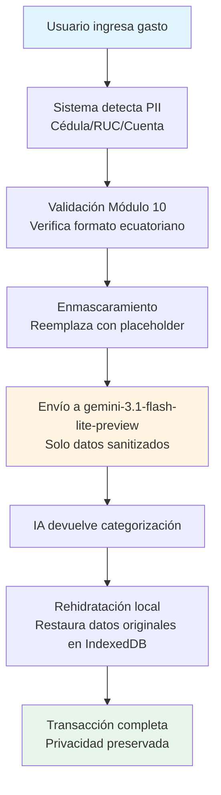
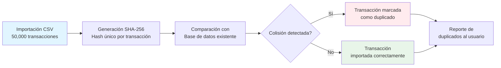
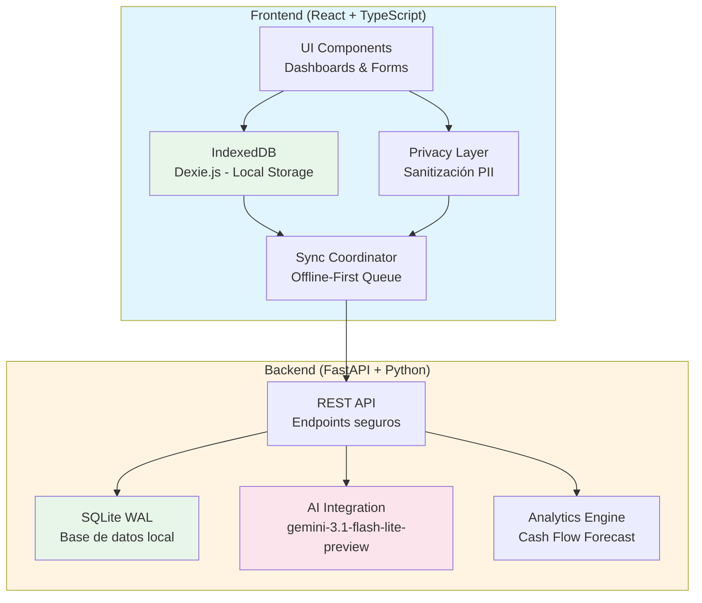

# 🏛️ Tabula Rasa: Local-First Financial Operating System

**La soberanía absoluta de tus finanzas. Privacidad blindada, integridad matemática y latencia cero.**


---

## 📖 Filosofía Local-First: Soberanía del Dato

**Tus datos te pertenecen. Punto.**

Tabula Rasa rechaza el modelo SaaS donde tus datos financieros viven en servidores de terceros. En su lugar, implementamos una arquitectura **Local-First** donde:

- **IndexedDB** es tu base de datos en el navegador (ningún dato sale sin tu consentimiento explícito)
- **Sincronización Reactiva** con FastAPI + SQLite en modo WAL para concurrencia sin bloqueos
- **Offline-First**: Trabaja sin internet, sincroniza cuando reconectes
- **Zero-Knowledge AI**: La IA solo ve datos sanitizados (Cédulas/RUCs enmascarados antes del envío)

---

## 🏗️ Los 4 Pilares de la Ingeniería en Tabula Rasa

### 💎 Integridad Monetaria

**Inmunidad total a los errores de redondeo IEEE 754.**

Imagina que estás calculando el interés compuesto de tu inversión a 5 años. Un error de redondeo de 0.0001 centavos puede acumularse en cientos de dólares. Tabula Rasa usa tipos nominales (`Cents`) y aritmética de precisión arbitraria para garantizar que cada centavo cuente exactamente, sin sorpresas matemáticas.

### 🛡️ Blindaje Zero-Knowledge: Privacidad Absoluta

**Sanitización exhaustiva antes de enviar datos a la API.**

Cuando ingresas un gasto, el sistema intercepta automáticamente cualquier información personal sensible (Cédulas, RUCs, números de cuenta) y la enmascara usando validación Módulo 10. Solo entonces viaja al modelo de IA, y el sistema "rehidrata" el dato localmente en IndexedDB después de recibir la respuesta.



### ⏳ Identidad Determinista

**Sin colisiones, incluso al importar 50,000 transacciones.**

Imagina que exportas un CSV de tus consumos en Sweet & Coffee o el pago de tu membresía del gimnasio desde tu banco y lo importas dos veces por accidente. Tabula Rasa genera un hash criptográfico único para cada transacción, detectando la colisión y evitando cobros duplicados mágicamente, incluso si importas 50,000 registros de golpe.



### ⏱️ Autoconciencia Temporal

**Si alteras el pasado, el presente se invalida automáticamente.**

Cuando corriges una transacción histórica (por ejemplo, cambias el monto de un gasto de hace 6 meses), Tabula Rasa detecta automáticamente que los snapshots de patrimonio neto están desactualizados. El sistema los marca como obsoletos y los recalcula en segundo plano, garantizando que tus proyecciones de Cash Flow siempre se basen en datos consistentes.

---

## 🚀 Innovaciones Técnicas

### 🧠 Motor de IA: gemini-3.1-flash-lite-preview

**Inteligencia artificial sin comprometer la soberanía del dato.**

Tabula Rasa integra gemini-3.1-flash-lite-preview como un asistente invisible que trabaja en segundo plano. La IA analiza patrones en tus transacciones para:

- **Categorización automatizada**: Clasifica gastos e ingresos basándose en descripciones bancarias
- **Detección de anomalías**: Identifica patrones de consumo inusuales que podrían indicar fraudes o errores
- **Cash Flow Forecast**: Proyecta tu liquidez disponible para los próximos 30, 60 y 90 días

Lo más importante: tus datos reales nunca salen de tu máquina. El sistema sanitiza toda información personal antes de enviarla a la IA, y solo recibe categorizaciones y patrones abstractos como respuesta.

**Caso de uso real**: Estás planeando comprar un vehículo a fin de año usando tus bonos o décimos. El Cash Flow Forecast analiza tus patrones de gastos históricos, proyecta tu flujo de caja futuro y te dice exactamente cuánto capital podrás abonar a la deuda vehicular en diciembre, todo esto sin que tus datos financieros reales salgan de tu computadora.

### Protocolo Phoenix: Autocorrección de Entorno

**El sistema se cura solo al arrancar.**

Tabula Rasa incluye un sistema de auto-curación. Si tu entorno virtual se corrompe o un puerto se queda "zombie", el sistema lo detecta al arrancar, purga los procesos estancados y reinstala las dependencias silenciosamente usando uv para levantar la interfaz en segundos.

No necesitas saber Python ni Node.js. El script de inicio maneja todo:

1. Detecta y limpia puertos zombies (8001, 5173)
2. Valida la integridad del entorno virtual
3. Reinstala dependencias automáticamente si están corruptas
4. Inicia backend y frontend en el orden correcto
5. Espera hasta que el backend esté saludable antes de abrir el navegador

### Storage Guardian: Monitoreo Proactivo de Cuota

**Alerta al 80%, crítico al 95%. Nunca te sorprenda sin espacio.**

El sistema monitorea continuamente el uso de almacenamiento de IndexedDB. Cuando alcanzas el 80% de cuota, recibes una advertencia. Al 95%, el sistema entra en modo crítico y ajusta automáticamente la política de sincronización para priorizar datos esenciales.

### ⚡ Lógica Avanzada: Telemetría y Depreciación

**Cálculo de activos y reportes multidivisa con precisión bancaria.**

Tabula Rasa incluye herramientas contables profesionales:

- **Depreciación de activos**: Cálculo automático con métodos estándar (línea recta, saldo decreciente)
- **Reportes multidivisa**: Balance sheet con conversión en tiempo real entre USD, EUR y otras monedas
- **Telemetría anónima**: Métricas de uso y rendimiento sin información personal identificable

### Higiene de Memoria: Exportación via Streaming

**50,000+ transacciones sin congelar la interfaz.**

Cuando exportas tu historial financiero completo, Tabula Rasa usa streaming para procesar los datos en chunks de 500 registros. Esto significa que puedes exportar 50,000 transacciones a CSV sin que la interfaz se congele, incluso en computadoras con recursos limitados.

---

## ✨ Core Features

### Dashboards Reactivos
- **Dashboard Principal**: Tarjetas de resumen, transacciones recientes, breakdown de gastos
- **Cash Flow Forecast**: Proyección a 30/60/90 días con detección de saldos negativos
- **Safe to Spend**: Cálculo inteligente de presupuesto disponible considerando gastos fijos, deudas y proyecciones estacionales

### Parsers Bancarios Inteligentes (Ecuador)
Soporte nativo para los principales bancos ecuatorianos:
- **Banco Pichincha**: FECHA, DESCRIPCION, DEBITO, CREDITO
- **Banco Guayaquil**: FECHA, CONCEPTO, VALOR
- **Banco Pacífico**: FECHA TRANSACCION, DESCRIPCION, ABONO, CARGO
- **Parser genérico**: Fallback inteligente para otros formatos

### Búsqueda Avanzada con Normalización Unicode
Búsqueda insensible a tildes y diacríticos. "pago" coincide con "págó", "pagó", "PÁGO" — todas las variaciones funcionan gracias a la normalización Unicode NFD.

### Gestión de Conflictos Offline-First
- **FIFO Queue**: Sincronización en orden cronológico
- **Conflict Stashing**: Conflictos se archivan para resolución manual
- **Server Wins Policy**: El servidor prevalece para estado, pero el usuario decide qué datos mantener
- **Bit-a-bit Integrity Verification**: Hashes SHA-256 para detectar corrupción en tránsito

---

## 📁 Arquitectura del Sistema

Tabula Rasa utiliza una arquitectura híbrida que combina lo mejor de dos mundos:



**Flujo de datos:**
1. **Frontend** maneja toda la lógica de UI y almacenamiento local en IndexedDB
2. **Privacy Layer** sanitiza datos antes de cualquier comunicación externa
3. **Sync Coordinator** gestiona la cola offline y resuelve conflictos
4. **Backend** proporciona API REST, análisis avanzado e integración con IA
5. **SQLite WAL** asegura concurrencia sin bloqueos para múltiples operaciones

---

## ⚡ Instalación en 30 Segundos

### Requisitos Previos
- **Python 3.12+** (validado automáticamente)
- **Node.js 18+**
- **Windows PowerShell**

### Instalación Automática (Recomendado)

```powershell
# Ejecutar en PowerShell (preferiblemente como Administrador)
.\menu.ps1
```

El script `menu.ps1` maneja todo automáticamente:

1. ✅ **Valida Python 3.12+** (aborta si es incompatible)
2. ✅ **Limpia puertos zombies** (mata procesos en 8001/5173)
3. ✅ **Crea entorno virtual** si no existe
4. ✅ **Instala dependencias con uv** (10-100x más rápido que pip)
5. ✅ **Valida integridad del backend** (reinstala si está corrupto)
6. ✅ **Inicia backend** (FastAPI en puerto 8001)
7. ✅ **Health Check Polling** (espera hasta que backend responda)
8. ✅ **Instala dependencias Node** si faltan
9. ✅ **Inicia frontend** (Vite en puerto 5173)
10. ✅ **Abre navegador** automáticamente en `http://localhost:5173`

### Instalación Manual (Si prefieres control total)

#### Backend
```bash
cd backend
python -m venv venv
venv\Scripts\activate
pip install uv
uv pip install -r requirements.txt
uvicorn main:app --host 0.0.0.0 --port 8001
```

#### Frontend
```bash
cd frontend
npm install
npm run dev
```

---

## 🔧 Stack Tecnológico

### Backend
- **Python 3.12+** con FastAPI (framework web moderno y asíncrono)
- **SQLite** en modo WAL (Write-Ahead Logging para concurrencia sin bloqueos)
- **SQLAlchemy** ORM con Alembic migrations (gestión de esquema robusta)
- **UUIDv5** para identidad determinista (mismo input = mismo UUID siempre)
- **Cryptography** para hashing SHA-256 (integridad de datos)

### Frontend
- **React 18** con TypeScript (tipado estático para seguridad)
- **Vite** (build tool ultrarrápido con HMR instantáneo)
- **Dexie.js** (wrapper de IndexedDB con API promisada)
- **Decimal.js-light** (precisión monetaria arbitraria)
- **TailwindCSS** (styling utility-first para desarrollo rápido)
- **Lucide React** (iconos modernos y consistentes)

---

## 🎯 ¿Por qué Tabula Rasa es diferente?

| Característica | Apps SaaS Comunes | Tabula Rasa |
|---------------|------------------|-------------|
| **Propiedad de datos** | Servidores de terceros | Tu navegador (IndexedDB) |
| **Offline** | Requiere internet | Offline-first completo |
| **Privacidad IA** | Datos crudos a la nube | Zero-Knowledge (sanitizado) |
| **Precisión monetaria** | Float IEEE 754 (errores) | Branded Types + Decimal.js |
| **Conflictos offline** | Sobrescritura silenciosa | FIFO queue + resolución manual |
| **Importación masiva** | Crash >10k registros | Streaming 50k+ sin freeze |
| **Auto-reparación** | Manual | Protocolo Phoenix automático |

---

## 🌟 Posicionamiento en el Mercado

### Nivel Técnico: Enterprise-Grade para Usuarios Individuales

Tabula Rasa opera en un nivel técnico comparable a sistemas financieros empresariales, pero diseñado para uso personal. Combina prácticas de ingeniería de producción con la simplicidad de una aplicación personal.

**Comparación con Sistemas Financieros Actuales:**

| Aspecto | Software Contable Tradicional | Apps Financieras SaaS | Tabula Rasa |
|---------|------------------------------|----------------------|-------------|
| **Arquitectura** | Monolítica, on-premise | Cloud-native, multi-tenant | Local-First híbrido |
| **Latencia** | Alta (servidor local) | Media (roundtrip cloud) | Cero (datos locales) |
| **Privacidad** | Control total (si auto-hosteado) | Baja (datos en cloud) | Máxima (Zero-Knowledge) |
| **Offline** | Dependiente de red | Limitado o nulo | Completo |
| **Costo** | Alto (licencias + infraestructura) | Suscripción mensual | Gratis (auto-hosteado) |
| **Actualizaciones** | Manual, complejas | Automáticas, forzadas | Automáticas, opcionales |
| **IA Integrada** | Rara vez o básica | Variable, datos en cloud | Avanzada, Zero-Knowledge |

### Ventajas Competitivas Únicas

**1. Privacidad sin Sacrificar Funcionalidad**
A diferencia de las apps SaaS que requieren enviar tus datos a la nube para usar IA, Tabula Rasa sanitiza localmente antes de cualquier comunicación externa. Obtienes el poder de gemini-3.1-flash-lite-preview sin exponer tu información financiera.

**2. Resiliencia Operativa**
El Protocolo Phoenix asegura que el sistema se recupere automáticamente de corrupciones de entorno, algo que ni el software contable tradicional ni las apps SaaS ofrecen. Tu sistema financiero nunca queda "roto" por una actualización fallida.

**3. Escalabilidad Local**
Puedes importar 50,000+ transacciones sin que la interfaz se congele, gracias a streaming y buffers inteligentes. La mayoría de las apps SaaS fallan con importaciones masivas de más de 10,000 registros.

**4. Precisión Bancaria Garantizada**
Mientras que las apps SaaS comunes usan float IEEE 754 (propenso a errores de redondeo), Tabula Rasa implementa tipos nominales y aritmética de precisión arbitraria. El mismo nivel de precisión que los sistemas bancarios core.

### En Resumen

Tabula Rasa no es "otra app de finanzas personales". Es un **Sistema Operativo Financiero Local-First** que combina:
- La robustez de software empresarial
- La privacidad de sistemas on-premise
- La inteligencia de IA moderna
- La simplicidad de una aplicación personal

Es para usuarios que valoran la soberanía de sus datos tanto como la funcionalidad avanzada.

---

## 📊 Roadmap

- [ ] **Multi-currency**: Soporte para USD, EUR con conversión en tiempo real
- [ ] **Recurring Transactions**: Automatización de gastos recurrentes
- [ ] **Advanced Analytics**: Plotly integrado para visualizaciones interactivas
- [ ] **Mobile PWA**: Progressive Web App para acceso móvil
- [ ] **Dark Mode**: Toggle de tema claro/oscuro
- [ ] **Export PDF**: Reportes en PDF para contadores

---

## 📄 Licencia

Este proyecto es para uso personal.

---

## 🤝 Contribuciones

Tabula Rasa es un proyecto personal. Sin embargo, el código está documentado extensamente para fines educativos. Si encuentras un bug o tienes una sugerencia, siéntete libre de abrir un issue.
